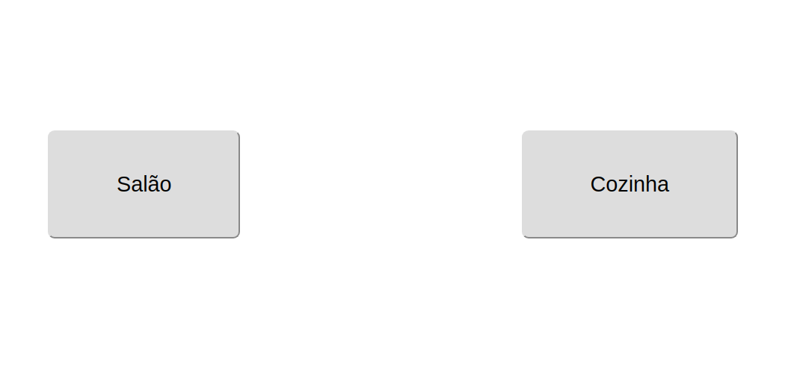
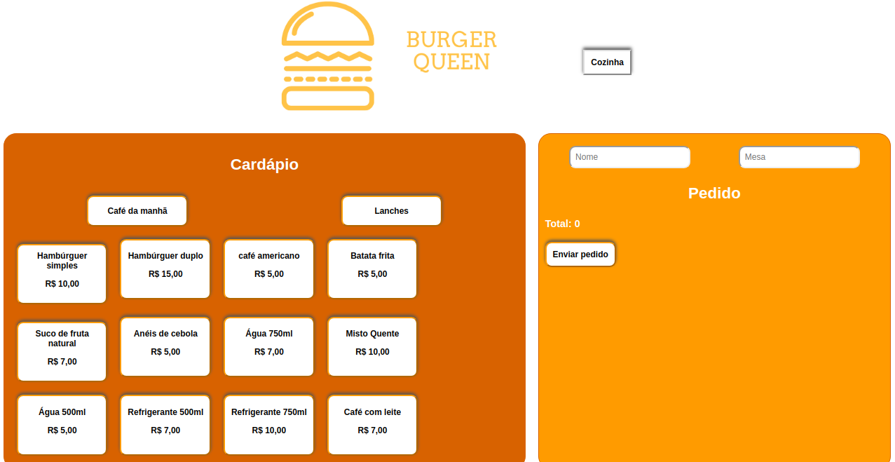
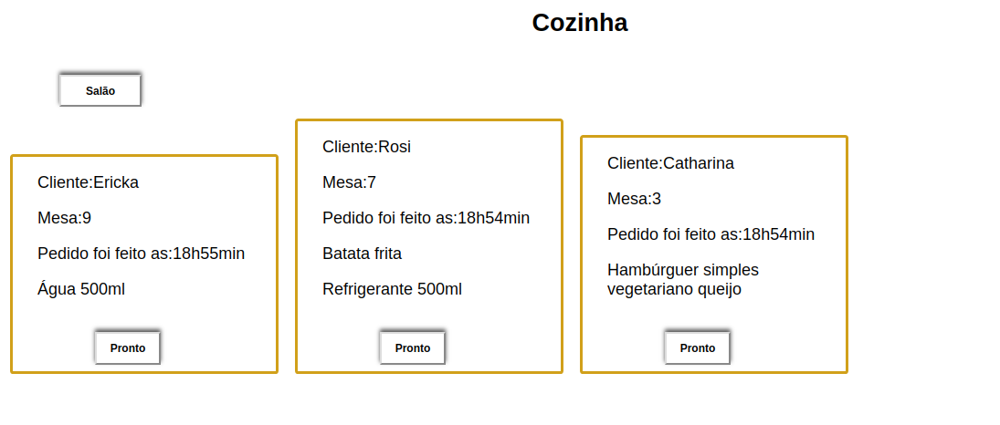

# Burger Queen

## Índice

* [1. Resumo](#1-Resumo)
* [2. Ferramentas](#2-Ferramentas)
* [3. Imagens](#3-Imagens)

***

## 1. Resumo

 Esse é um aplicativo que possui uma interface feita para um pequeno restaurante de hambúrgueres com objetivo de facilitar a aplicação e organização dos pedidos utilizando um tablet, enviá-los para a cozinha para que sejam preparados de forma ordenada e eficiente.

 Com dois ambientes, o salão e a cozinha, no primeiro é possível filtrar entre "café da manhã" e "lanches", clicar no pedido escolhido e assim o mesmo ser adicionado na outra sesssão, a dos pedidos. Nesta é possível somar os itens escolhidos do cardápio e somar o total dos valores, bem como poder deletar. Ao final, o clique envia esses pedidos para cozinha com os dados: número da mesa,nome do cliente, o horário e os itens escolhidos, para assim os cozinheiros poderem começar a preparar as comidas. É nesse sentido, de comunicação entre dois ambientes e praticidade que esse aplicativo se propõe a ajudar o restaurante

## 2. Ferramentas

* React
* JavaScript
* Aphrodite
* Firebase

## 3. Imagens

